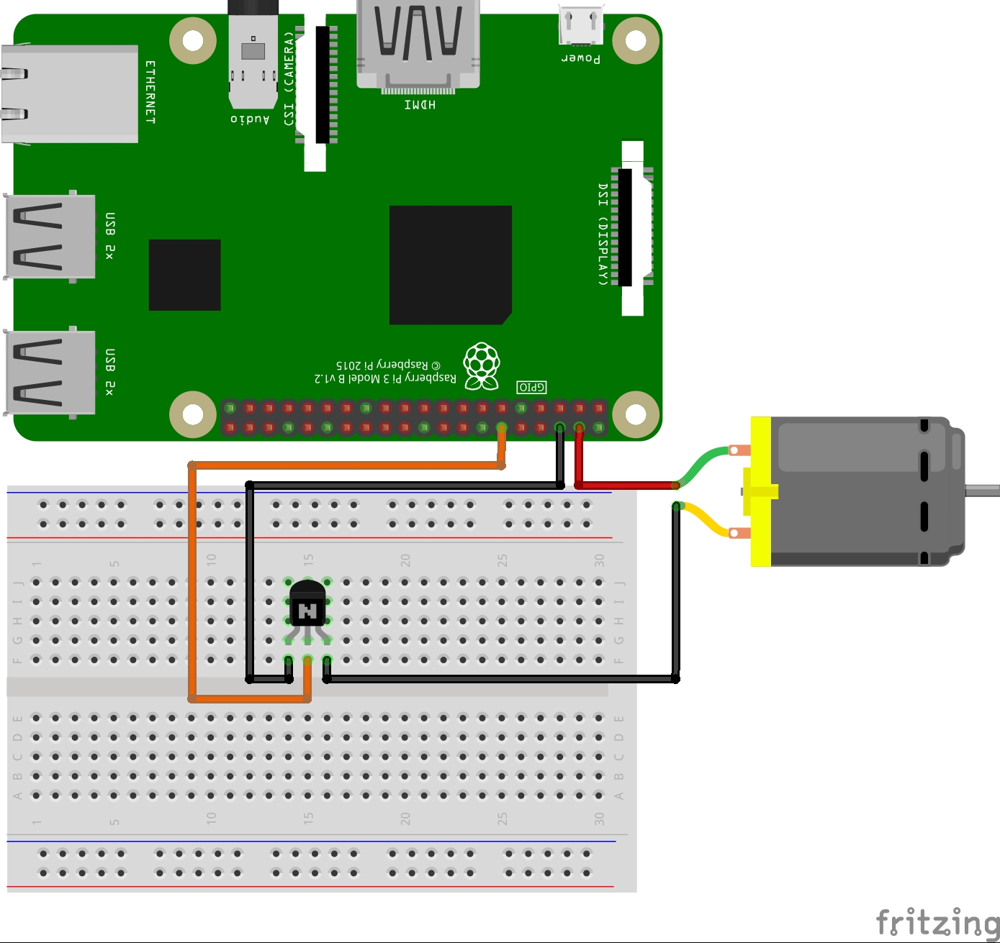
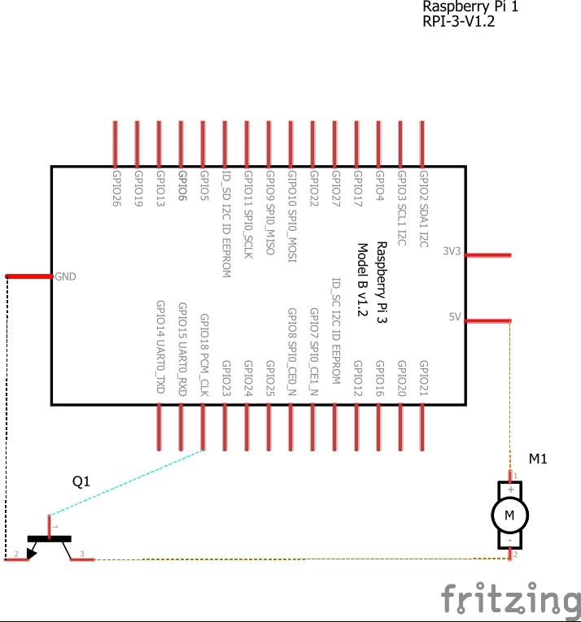

RpiCpuFan
============================================================
Raspberry Pi - CPU Temperature Controlled GPIO Fan

Breadboard Wiring
---------------------------------

Schematics
---------------------------------

Download RpiCpuFan from git
---------------------------------

    cd /opt/

    sudo git clone https://github.com/rdeangel/RpiCpuFan RpiCpuFan

Install RpiCpuFan
---------------------------------

    cd RpiCpuFan

    sudo ./install.sh

Verify RpiCpuFan is running
---------------------------------

    sudo systemctl status RpiCpuFan

    ps aux | grep RpiCpuFan | grep -v grep

Enable RpiCpuFan to start at boot
---------------------------------

    sudo systemctl enable RpiCpuFan.service

or

    update-rc.d RpiCpuFan enable

Disable RpiCpuFan to start at boot
---------------------------------

    sudo systemctl disable RpiCpuFan.service

or

    sudo update-rc.d RpiCpuFan disable

Start RpiCpuFan service manually
---------------------------------

    sudo systemctl start RpiCpuFan.service

or

    sudo service RpiCpuFan start

or

    sudo /etc/init.d/RpiCpuFan start

Stop RpiCpuFan service manually
---------------------------------

    sudo systemctl stop RpiCpuFan.service

or

    sudo service RpiCpuFan stop

or

    sudo /etc/init.d/RpiCpuFan stop

Start RpiCpuFan on terminal for live console messages
---------------------------------

    sudo /opt/RpiCpuFan/RpiCpuFan.py -v

Optimally tune your Fan experimenting with On and Off Temperature Options and 3 type of message logging
---------------------------------

    sudo /opt/RpiCpuFan/RpiCpuFan.py --on-temp=55 --off-temp=50 --pin=18 --interval=5 -v --local-log=/var/log/RpiCpuFan.log --syslog=192.168.1.21 -a

